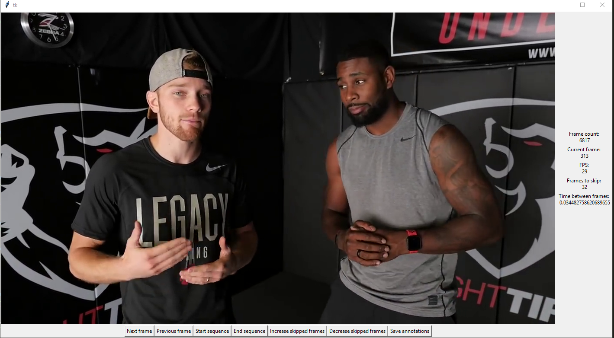

# pyvideoannotate


A simple video browser with Python and Tkinter. Go through video frames and mark the interesting sequence begin and end points. Uses opencv for the video reading


## Features

#### Current

* Load annotations from file
* Save annotations to file

#### Coming

* subclass the annotator and override the part for displaying detected objects to annotate any shape or format object detections (pose, bboxes)
* reannotate already existing detections or annotations with additional classes


## Usage

The only dependency of PyViAnnotate is opencv. This is developed with opencv 4, but will probably work with opencv 2.4 and 3.* as well since only core features are used. Opencv python bindings are found on the PyPI on most platforms, no need to start installing it separately.

Install

```shell
python3 -m pip install -r requirements.txt
```

Use

```shell
python3 annotate_video.py --video /path/to/video.mp4
```


## Demo

A small demo picture. GUIs made with Tkinter have a professional look from the 90s.




##  Annotation file format

Annotation files are stored as json. The objects are stored for each frame. The coordinates of detected objects are stored as a list of coordinates. This allows storing more complicated shapes that just boxes. For bounding boxes, two coordinates are stored, the upper left and the lower right corner. A unique object id is also stored for each detection. It can be used for tracking the object through frames. 

```json
{
	"frame_count" : 1, 
	"frames": [

		{
			"frame_index": 0,
			"objects" : [
				{
					"class_name" : "class1",
					"class_id" : 1,
					"object_id" : 0,
					"object_coords" : [
						{
							"x": 123,
							"y": 123
						}
					]
				}
			]
		}
	]
}
```
